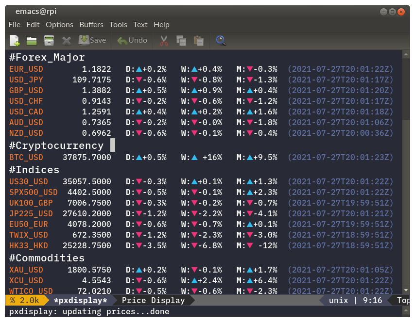

# pxdisplay.el

Draft Emacs major mode for fetching/displaying financial prices.



## How to use it

Add the following to your `.emacs`:
```
(add-to-list 'load-path "~/.emacs.d/pxdisplay")` ; or wherever you put it
(require 'pxdisplay)
(setq pxdisplay-account "YOURACCOUNT") ; your account
(setq pxdisplay-token "YOURTOKEN")     ; your API token
```
* Launch/refresh with `M-x pxdisplay`
* Refresh in the `*pxdisplay*` buffer by pressing `r`

Currently only the OANDA REST API is supported http://developer.oanda.com/rest-live-v20/introduction/
